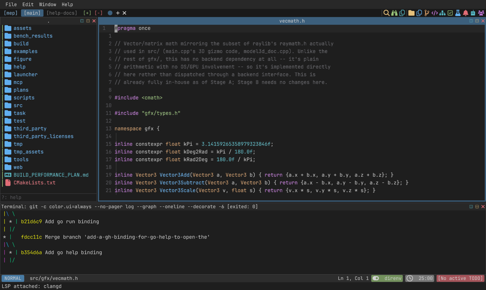
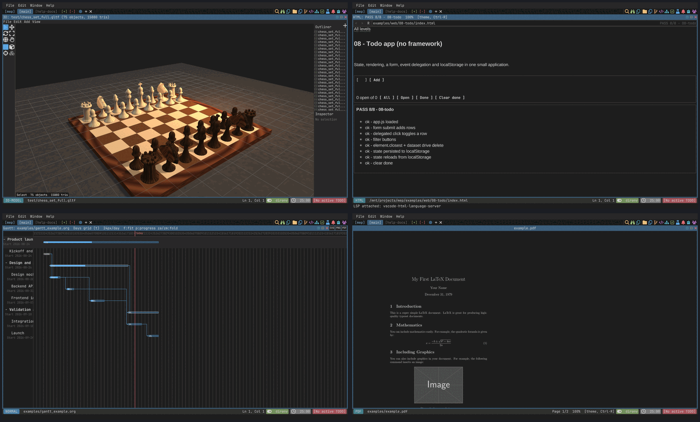

* mep

/An editor where everything is in place./

mep is a modal, Vim-style code editor for Linux, written from the ground
up in C++20 with embedded Lua. There is no UI toolkit, no browser engine
and no PDF library underneath it: the window, the renderer, the font
rasterizer, the regex engine, the terminal emulator and the readers for
every format it opens are all in this repository.

That buys the thing the name is about — one place to work. A C++ file, a
shell, a PDF, a Jupyter notebook, a 3D scene and a live web page are all
just panes in the same window, driven by the same keys, scripted through
the same Lua API.

* Install

** Nix (no clone needed)

#+begin_src sh :eval no
nix run github:jordanschupbach/mep              # run it
nix profile install github:jordanschupbach/mep  # install it
#+end_src

** From source

You need CMake ≥ 3.28, a C++20 compiler, and — on the system — OpenGL,
X11 (with =Xtst= and =Xi=), ALSA and OpenSSL. The configure step fetches
Lua 5.4, so it needs network access the first time.

#+begin_src sh :eval no
git clone https://github.com/jordanschupbach/mep
cd mep
cmake -S . -B build/native -DCMAKE_BUILD_TYPE=Release
cmake --build build/native -j
sudo cmake --install build/native      # optional; installs `mep`
#+end_src

Inside the repo, [[https://github.com/casey/just][just]] wraps the same thing: =just run= builds and
launches, =just build-native= only builds, =just clean= removes
=build/=. =nix develop= (or =direnv allow=) drops you in a shell with the
whole toolchain — compiler, cmake, just, deno, emscripten, language
servers and Tree-sitter grammars — already on =PATH=.

** Platforms

Native mep targets *Linux/X11*. There is also a WebAssembly build
(=just build-web=) that runs in a browser, and =just run-wasm= opens it
in a desktop window via Deno + webview; the wasm build has no host
filesystem, so file I/O there goes through a small local bridge
([[file:docs/architecture.org][details]]).

* Getting started

#+begin_src sh :eval no
mep                 # opens the dashboard on the current directory
mep path/to/file    # opens a file
#+end_src

- The leader key is =Space=. Press it and wait: a which-key popup lists
  every group and binding. =<leader>hk= searches all of them.
- =<leader>hh= (or =:MepHelp=) opens the built-in help.
- =<leader>ff= file tree, =<leader>/= find in buffer, =<leader>pr=
  project-wide grep, =<leader>bb= buffer picker, =<leader><CR>= a
  terminal for this tab.
- Vim's own =:= commands mostly work as you'd expect — =:w=, =:e=,
  =:split=, =:%s/pat/repl/g=, =:g/pat/d=.

The full reference is [[file:docs/keybindings.org][docs/keybindings.org]].

* What's in the box

*Editing.* Normal / Insert / Replace / Visual (charwise, linewise,
blockwise) / Command-line modes. Counted motions and operators, text
objects, registers (the unnamed register *is* the system clipboard),
marks, the jump list, =.=-repeat, macros, per-buffer undo. Regex search
and =:s=/=:g=, with backreferences. A flash.nvim-style quick jump (=s=)
that labels matches across every visible pane. Tree-sitter highlighting,
with ~49 further languages a =just fetch-grammars= away.

*Windows.* Splits and tabs with directional navigation (=Ctrl-W hjkl=,
=mod1+hjkl=), per-pane buffer tabs, pane zoom and maximize. Projects
contain workspaces (backed by git worktrees) contain tabs contain panes,
and each project's layout is saved and restored.

*IDE.* LSP — completion, hover, definition, references, implementation,
rename, code actions, diagnostics, formatting. DAP debugging. Snippets,
spell check, a task runner that finds your =just=/=make=/=ninja=/=cmake=
setup. GitHub Copilot inline completions ([[file:docs/copilot.org][setup]]).

*Git.* Gutter signs against any base ref, hunk preview, staging and
navigation, and a five-view panel: status, log, graph, branches, stash.

*Sidebars.* File tree, symbols, structure outline, git, todo, tests,
notifications and AI agents — dockable to either edge, stacked and
resizable, and each one pops out into a large preview float with
=mod1+m=.

*Beyond text.* Every one of these opens as a pane, from mep's own code:

| Open this | And you get |
|-----------+-------------|
| =.pdf= | a PDF viewer with real text extraction, outlines and links |
| =.html= (or =:Browse <url>=) | a browser pane with mep's own HTML/CSS/JS engine; =:Serve= hosts a directory ([[file:docs/web.org][more]]) |
| =.png=, =.jpg=, … | an image viewer, and =e= enters a layer-based editor with procedural fills ([[file:IMAGE_EDITOR.md][more]]) |
| =.obj=, =.gltf=, =.glb=, =.iqm=, =.vox=, =.m3d= | a 3D modeler: mesh editing, materials, lights, animation, rendering (=.blend= too, via a local Blender) |
| =.ipynb= | a Jupyter notebook with per-cell kernels, run without =jupyter_client= ([[file:docs/notebooks.org][more]]) |
| =.org= | agenda, babel, roam, capture, clock, drill, LaTeX and image preview, export, plus =:Gantt= and =:Kanban= views |
| =.docx=, =.odt=, =.xlsx=, =.ods=, =.csv= | office documents and spreadsheets, with formulas |
| =.mov= | a video player |
| =:terminal= | a real terminal emulator |

*Collaboration and agents.* CRDT-based shared editing over a
self-hosted relay ([[file:docs/collaboration.org][docs]]). An agent-control socket, and a =mep-mcp=
MCP server on top of it, let an AI agent drive the editor directly —
buffers, panes, workspaces, the image editor and the 3D modeler — while
you watch ([[file:MEP_AGENT_API.md][API]]).

*Learning games.* An org file doubles as a flashcard deck, and 24 game
modes deal sessions from it ([[file:docs/learn-games.org][docs]]).

* Configuration

mep reads =$XDG_CONFIG_HOME/mep/init.lua= (or =~/.config/mep/init.lua=)
at startup. It is ordinary Lua against the same =mep.*= API the editor's
own built-in configuration uses.

#+begin_src lua :eval no
-- One of 62 built-in themes; :MepTheme picks one interactively.
mep.cmd('colorscheme gruvbox-dark')

-- A command and a leader binding of your own.
mep.command('Hello', function() mep.notify('hello from init.lua') end)
mep.leader_map('xh', 'Say hello', function() mep.cmd('Hello') end)

-- Rebind the mod1 modifier, and turn Copilot off.
mep.set_mod1('super')
mep.copilot_enabled = false
#+end_src

=:lua <code>= evaluates a line, =:source <file>= loads a script. The
whole surface is in [[file:docs/lua-api.org][docs/lua-api.org]].

* Documentation

| [[file:docs/keybindings.org][Keybindings and commands]] | every key and =:= command |
| [[file:docs/lua-api.org][Lua API]] | the =mep.*= table |
| [[file:docs/architecture.org][Architecture]] | the source tree, for contributors |
| [[file:docs/notebooks.org][Notebooks]] | Jupyter cells and kernels |
| [[file:docs/web.org][Browser pane]] | the web engine, =:Serve=, the capability ladder |
| [[file:docs/copilot.org][Copilot]] | setup, commands, what gets sent |
| [[file:docs/collaboration.org][Collaboration]] | shared editing and running your own relay |
| [[file:docs/learn-games.org][Learning games]] | the deck format and the games |
| [[file:MEP_AGENT_API.md][Agent API]] | driving mep from a script or an AI agent |
| [[file:IMAGE_EDITOR.md][Image editor]] | tools and hotkeys |

* Development

#+begin_src sh :eval no
just run                # build and launch
just build-native-dev   # -O0 build in build/native-dev, for fast iteration
just test               # windowless unit tests
just test-gui           # the tests that drive a real window
just bench              # performance suite, results in bench_results/
just lint               # clang-tidy + cppcheck + include-what-you-use
#+end_src

Tests and benchmarks are =EXCLUDE_FROM_ALL=, so an ordinary build
produces only =mep=, =mep-mcp= and =mep-collabd=. Start at
[[file:docs/architecture.org][docs/architecture.org]] for the layout of the source tree.

* License

MIT. See [[file:LICENSE][LICENSE]]; bundled third-party licenses are in
=third_party_licenses/=.
