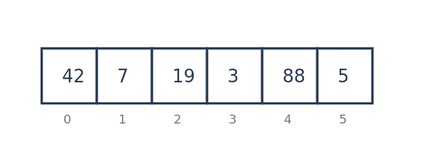
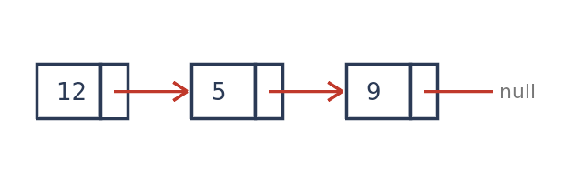
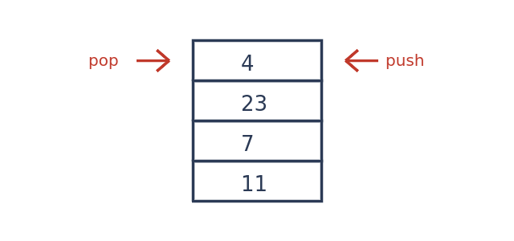
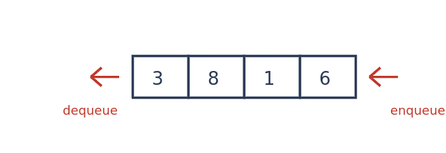
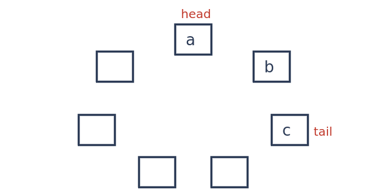
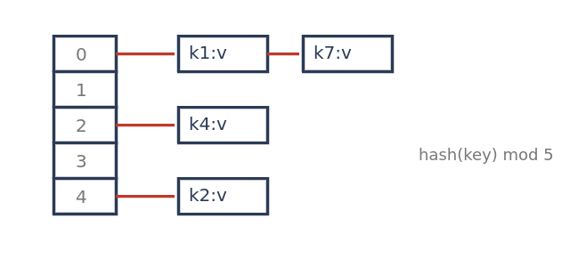
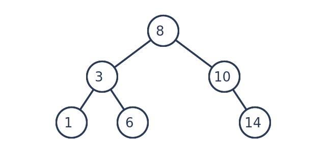
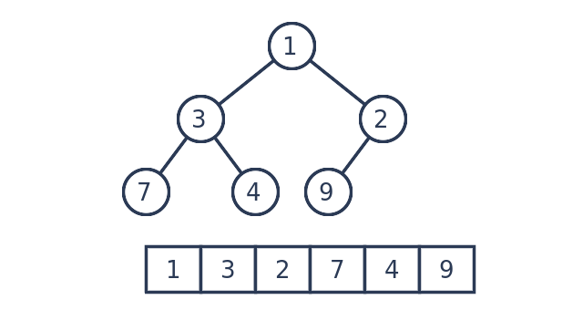
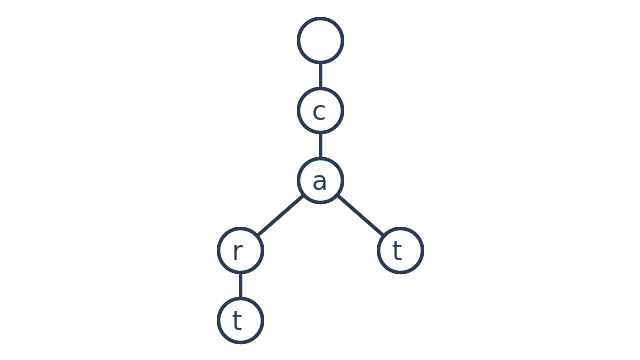
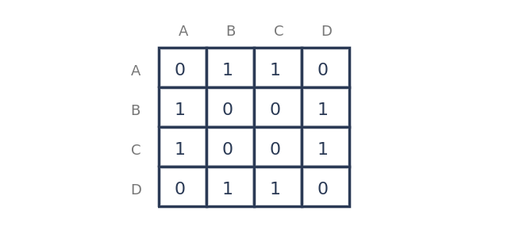

#+TITLE: Basic Data Structures
#+LEARN_TITLE: Basic Data Structures
#+LEARN_CHOICES: 4
#+LEARN_DIRECTION: both
#+LEARN_ROUNDS: 0
#+LEARN_MATCH_SIZE: 5
#+LEARN_FACTS: ACCESS SEARCH INSERT BUILT_ON
#+LEARN_RANK: YEAR
#+LEARN_TIME_LIMIT: 0
#+LEARN_SRS: no

# A learning deck: this file is the question database for mep's learning
# games. Each headline tagged :card: is one entry -- its title is the term,
# its body the definition. Games draw a randomized session from the deck.
# The full format is in plans/LEARN_GAMES_PLAN.md; in short:
#
# Deck keywords (all optional):
#   #+LEARN_TITLE:      shown in the game header (falls back to #+TITLE:)
#   #+LEARN_TAG:        the tag marking a card (default: card); with no
#                       tagged headline at all, every headline with a body
#                       is a card
#   #+LEARN_CHOICES:    answers offered per choice question (4)
#   #+LEARN_DIRECTION:  term | definition | both (flashcards)
#   #+LEARN_ROUNDS:     questions (or rounds) per session (0 = all)
#   #+LEARN_MATCH_SIZE: pairs per matching round (5; 2-9)
#   #+LEARN_FACTS:      property keys the fact quiz asks about (else any
#                       non-reserved key, plus 2-column tables)
#   #+LEARN_RANK:       numeric property keys rank-by-fact orders by
#                       (else any numeric fact on three or more cards)
#   #+LEARN_TIME_LIMIT: seconds per question for choice games (0 = none)
#   #+LEARN_MIXED:      game keys mixed practice draws from (else all)
#   #+LEARN_SRS:        yes = deal due cards first (org-drill :DRILL_DUE:,
#                       written by the summary's [g] grade key)
#
# Card properties (all optional, in the headline's :PROPERTIES: drawer):
#   :CATEGORY:    groups cards; wrong answers are drawn from the same
#                 category first (defaults to the parent headline's title)
#   :QUESTION:    a custom prompt used instead of the definition
#   :HINT:        shown after a wrong answer
#   :DISTRACTORS: extra wrong answers, separated by |
#   :ALIASES:     other accepted names, separated by | (type-the-term)
#   :HIDE:        extra identifiers to blank out in the card's code
#   :POINTS:      the card's jeopardy value (default 100, 200, ... in order)
#   any other key (:ACCESS:, :BUILT_ON:, ...) is a fact the fact quiz asks;
#   a numeric one (:YEAR:) can be ranked
#
# Card body:
#   {{answer}} or {{answer|hint}}   a blank for fill-in-the-blank
#   1. 2. 3. ...                    an ordered list = steps for put-in-order
#   | key | value |                 a 2-column table = more facts
#   #+begin_src python              the implementation (identify the code)
#   #+begin_src python :learn cloze code with {{blanks}} (complete the code)
#   #+begin_src python :learn bug :line N   a buggy copy (spot the bug)
#   #+begin_src python :learn output + #+RESULTS:   a demo (predict the output)
#   [[file:learn_images/x.png]]     a picture of the card, on its own line
#                                   (picture quiz)
#
# To play: put the cursor in one of the src blocks at the bottom and press
# C-c C-c (org-babel execute), or :Learn (<leader>ol) to pick a game, or
# any :Learn* command / <leader>og? key directly. In a game: digits and
# letters pick, n/Enter next, o opens the card here, r restarts, q quits
# (each game's last row lists its keys).

* Linear structures

** Array                                                            :card:
:PROPERTIES:
:HINT: Think "contiguous memory, index arithmetic".
:ACCESS: O(1)
:SEARCH: O(n)
:INSERT: O(n)
:END:
A fixed-size sequence of elements stored contiguously in memory and
addressed by an integer index, giving O(1) random access but O(n)
insertion or deletion in the middle.

** Dynamic array                                                    :card:
:PROPERTIES:
:ALIASES: vector | ArrayList | growable array
:HINT: Doubling the capacity keeps appends amortized O(1).
:ACCESS: O(1)
:SEARCH: O(n)
:INSERT: O(1) amortized
:BUILT_ON: Array
:END:
An array that grows on demand: when it fills up, a larger block is
allocated and the elements are copied over, so appends cost O(1)
amortized while random access stays O(1).

Appending when full:
1. Allocate a new block of double the capacity.
2. Copy every element across.
3. Free the old block.
4. Store the new element at the end.

#+begin_src python
class DynamicArray:
    def __init__(self):
        self._cap, self._n = 4, 0
        self._buf = [None] * self._cap

    def append(self, x):
        if self._n == self._cap:
            self._cap *= 2
            new = [None] * self._cap
            for i in range(self._n):
                new[i] = self._buf[i]
            self._buf = new
        self._buf[self._n] = x
        self._n += 1

    def __getitem__(self, i):
        if not 0 <= i < self._n:
            raise IndexError(i)
        return self._buf[i]
#+end_src

** Singly linked list                                               :card:
:PROPERTIES:
:HINT: You can only walk forward.
:ACCESS: O(n)
:SEARCH: O(n)
:INSERT: O(1) at the head
:YEAR: 1955
:END:
A chain of nodes where each node holds a value and a pointer to the next
node; O(1) insertion at the head, O(n) access by position, and no way to
walk backwards.

#+begin_src python
class Node:
    def __init__(self, value, link=None):
        self.value, self.link = value, link

class LinkedList:
    def __init__(self):
        self.head = None

    def prepend(self, value):
        self.head = Node(value, self.head)

    def find(self, value):
        cur = self.head
        while cur is not None:
            if cur.value == value:
                return cur
            cur = cur.link
        return None
#+end_src

** Doubly linked list                                               :card:
:PROPERTIES:
:ACCESS: O(n)
:SEARCH: O(n)
:INSERT: O(1) at either end
:END:
A chain of nodes where each node points to both its successor and its
predecessor, so a node can be removed in O(1) given only a pointer to it
and the list can be traversed in either direction.

** Stack                                                            :card:
:PROPERTIES:
:QUESTION: Which structure returns the most recently added element first (LIFO)?
:HINT: Last in, first out -- like a stack of plates.
:ACCESS: O(n)
:SEARCH: O(n)
:INSERT: O(1)
:BUILT_ON: Dynamic array
:END:
A {{last-in, first-out|LIFO}} collection supporting push and pop at one end, both
in O(1); used for {{call frames}}, undo histories and expression evaluation.

#+begin_src python
class Stack:
    def __init__(self):
        self._items = []

    def put(self, x):
        self._items.append(x)

    def take(self):
        if not self._items:
            raise IndexError("empty")
        return self._items.pop()

    def peek(self):
        return self._items[-1]
#+end_src

#+begin_src python :learn cloze
class Stack:
    def __init__(self):
        self._items = []

    def push(self, x):
        self._items.{{append}}(x)

    def pop(self):
        return self._items.{{pop}}()
#+end_src

#+begin_src python :learn bug :line 9
class Stack:
    def __init__(self):
        self._items = []

    def push(self, x):
        self._items.append(x)

    def pop(self):
        return self._items.pop(0)

    def peek(self):
        return self._items[-1]
#+end_src

#+begin_src python :learn output
s = Stack()
for x in (1, 2, 3):
    s.put(x)
print(s.take(), s.take())
#+end_src

#+RESULTS:
: 3 2

** Queue                                                            :card:
:PROPERTIES:
:QUESTION: Which structure returns the earliest added element first (FIFO)?
:HINT: First in, first out -- like a line at a counter.
:ACCESS: O(n)
:SEARCH: O(n)
:INSERT: O(1)
:BUILT_ON: Ring buffer
:END:
A {{first-in, first-out|FIFO}} collection where elements are enqueued at the back
and dequeued from the front, each in O(1); used for scheduling and
{{breadth-first}} traversal.

#+begin_src python
class Queue:
    def __init__(self):
        self._in, self._out = [], []

    def put(self, x):
        self._in.append(x)

    def take(self):
        if not self._out:
            while self._in:
                self._out.append(self._in.pop())
        if not self._out:
            raise IndexError("empty")
        return self._out.pop()
#+end_src

#+begin_src python :learn bug :line 6
class Queue:
    def __init__(self):
        self._in, self._out = [], []

    def put(self, x):
        self._out.append(x)

    def take(self):
        if not self._out:
            while self._in:
                self._out.append(self._in.pop())
        return self._out.pop()
#+end_src

#+begin_src python :learn output
q = Queue()
for x in (1, 2, 3):
    q.put(x)
print(q.take(), q.take())
#+end_src

#+RESULTS:
: 1 2

** Deque                                                            :card:
:PROPERTIES:
:ALIASES: double-ended queue
:ACCESS: O(n)
:SEARCH: O(n)
:INSERT: O(1) at either end
:BUILT_ON: Doubly linked list
:END:
A double-ended queue that allows O(1) insertion and removal at both the
front and the back, generalizing both the stack and the queue.

** Ring buffer                                                      :card:
:PROPERTIES:
:ALIASES: circular buffer
:HINT: The write index wraps around to the start.
:ACCESS: O(1)
:SEARCH: O(n)
:INSERT: O(1)
:BUILT_ON: Array
:END:
A fixed-size array used as a queue whose head and tail indices wrap
around modulo the capacity, so it never needs to shift elements and
works well for streaming data.

#+begin_src python
class RingBuffer:
    def __init__(self, capacity):
        self._buf = [None] * capacity
        self._head = self._n = 0

    def put(self, x):
        cap = len(self._buf)
        if self._n == cap:
            raise OverflowError("full")
        self._buf[(self._head + self._n) % cap] = x
        self._n += 1

    def take(self):
        x = self._buf[self._head]
        self._head = (self._head + 1) % len(self._buf)
        self._n -= 1
        return x
#+end_src

#+begin_src python :learn cloze
class RingBuffer:
    def __init__(self, capacity):
        self._buf = [None] * capacity
        self._head = self._n = 0

    def put(self, x):
        cap = len(self._buf)
        self._buf[(self._head + self._n) {{%}} cap] = x
        self._n += 1

    def take(self):
        x = self._buf[self._head]
        self._head = (self._head + {{1}}) % len(self._buf)
        self._n -= 1
        return x
#+end_src

#+begin_src python :learn output
r = RingBuffer(2)
r.put("a"); r.put("b"); r.take(); r.put("c")
print(r.take(), r.take())
#+end_src

#+RESULTS:
: b c

* Hash-based structures

** Hash table                                                       :card:
:PROPERTIES:
:ALIASES: hash map | dictionary
:HINT: A hash function turns the key into a bucket index.
:ACCESS: O(1) average
:SEARCH: O(1) average
:INSERT: O(1) average
:BUILT_ON: Array
:YEAR: 1953
:END:
A structure that maps keys to values by hashing each key to a {{bucket}}
index, giving O(1) average lookup, insertion and deletion, with
collisions handled by {{chaining}} or open addressing.

Looking up a key with chaining:
1. Hash the key.
2. Reduce the hash modulo the bucket count.
3. Scan that bucket's chain for the key.
4. Return its value, or report a miss.

#+begin_src python
class HashTable:
    def __init__(self, nbuckets=8):
        self._buckets = [[] for _ in range(nbuckets)]

    def _slot(self, key):
        return self._buckets[hash(key) % len(self._buckets)]

    def put(self, key, value):
        slot = self._slot(key)
        for i, (k, _) in enumerate(slot):
            if k == key:
                slot[i] = (key, value)
                return
        slot.append((key, value))

    def get(self, key):
        for k, v in self._slot(key):
            if k == key:
                return v
        raise KeyError(key)
#+end_src

** Hash set                                                         :card:
:PROPERTIES:
:ACCESS: O(1) average
:SEARCH: O(1) average
:INSERT: O(1) average
:BUILT_ON: Hash table
:END:
A collection of unique elements backed by a hash table, offering O(1)
average membership tests, insertion and removal but no ordering.

** Bloom filter                                                     :card:
:PROPERTIES:
:HINT: It can say "maybe" but never a false "no".
:ACCESS: n/a
:SEARCH: O(k)
:INSERT: O(k)
:BUILT_ON: Array
:YEAR: 1970
:END:
A space-efficient probabilistic structure using a bit array and several
hash functions to test set membership; it can report {{false positives}} but
never {{false negatives}}.

#+begin_src python
class BloomFilter:
    def __init__(self, nbits, nhashes):
        self._bits = [False] * nbits
        self._k = nhashes

    def _positions(self, item):
        for i in range(self._k):
            yield hash((i, item)) % len(self._bits)

    def add(self, item):
        for p in self._positions(item):
            self._bits[p] = True

    def __contains__(self, item):
        return all(self._bits[p] for p in self._positions(item))
#+end_src

* Trees

** Binary search tree                                               :card:
:PROPERTIES:
:HINT: In-order traversal yields sorted keys.
:ACCESS: O(log n) average
:SEARCH: O(log n) average
:INSERT: O(log n) average
:YEAR: 1960
:END:
A binary tree where every key in a node's left subtree is {{smaller}} and
every key in its right subtree is larger, giving {{O(log n)}} search, insert
and delete when the tree stays balanced.

Inserting a key:
1. Start at the root.
2. If the key is smaller, go left; if larger, go right.
3. Repeat until reaching an empty spot.
4. Place the new node there.

#+begin_src python
class Node:
    def __init__(self, key):
        self.key, self.left, self.right = key, None, None

class BinarySearchTree:
    def __init__(self):
        self.root = None

    def insert(self, key):
        def go(node):
            if node is None:
                return Node(key)
            if key < node.key:
                node.left = go(node.left)
            elif key > node.key:
                node.right = go(node.right)
            return node
        self.root = go(self.root)

    def contains(self, key):
        node = self.root
        while node is not None:
            if key == node.key:
                return True
            node = node.left if key < node.key else node.right
        return False
#+end_src

#+begin_src python :learn bug :line 13
class Node:
    def __init__(self, key):
        self.key, self.left, self.right = key, None, None

class BinarySearchTree:
    def __init__(self):
        self.root = None

    def insert(self, key):
        def go(node):
            if node is None:
                return Node(key)
            if key > node.key:
                node.left = go(node.left)
            elif key > node.key:
                node.right = go(node.right)
            return node
        self.root = go(self.root)
#+end_src

** Balanced binary search tree                                      :card:
:PROPERTIES:
:ALIASES: AVL tree | red-black tree
:DISTRACTORS: Complete binary tree | Full binary tree
:ACCESS: O(log n)
:SEARCH: O(log n)
:INSERT: O(log n)
:BUILT_ON: Binary search tree
:YEAR: 1962
:END:
A binary search tree that rebalances itself on insertion and deletion
(as in AVL or red-black trees) so its height stays O(log n) in the worst
case.

** Binary heap                                                      :card:
:PROPERTIES:
:ALIASES: heap | priority queue
:HINT: The parent of index i is at (i - 1) / 2.
:ACCESS: O(1) min/max
:SEARCH: O(n)
:INSERT: O(log n)
:BUILT_ON: Dynamic array
:YEAR: 1964
:END:
A complete binary tree, usually stored in an array, where every parent
is ordered before its children; it backs a priority queue with O(1)
peek at the minimum or maximum and O(log n) insert and extract.

Inserting into a min-heap:
1. Append the new element at the end of the array.
2. Compare it with its parent at (i - 1) / 2.
3. Swap them if the child is smaller.
4. Repeat from the new position until the parent is smaller or the root is reached.

#+begin_src python
class BinaryHeap:
    def __init__(self):
        self._a = []

    def put(self, x):
        a = self._a
        a.append(x)
        i = len(a) - 1
        while i > 0 and a[(i - 1) // 2] > a[i]:
            a[(i - 1) // 2], a[i] = a[i], a[(i - 1) // 2]
            i = (i - 1) // 2

    def take(self):
        a = self._a
        top, a[0] = a[0], a[-1]
        a.pop()
        i = 0
        while True:
            l, r, m = 2 * i + 1, 2 * i + 2, i
            if l < len(a) and a[l] < a[m]:
                m = l
            if r < len(a) and a[r] < a[m]:
                m = r
            if m == i:
                return top
            a[i], a[m] = a[m], a[i]
            i = m
#+end_src

#+begin_src python :learn cloze
class BinaryHeap:
    def __init__(self):
        self._a = []

    def put(self, x):
        a = self._a
        a.append(x)
        i = len(a) - 1
        while i > 0 and a[{{(i - 1) // 2}}] > a[i]:
            a[(i - 1) // 2], a[i] = a[i], a[(i - 1) // 2]
            i = (i - 1) // 2
#+end_src

#+begin_src python :learn output
h = BinaryHeap()
for x in (5, 1, 4, 2):
    h.put(x)
print(h.take(), h.take())
#+end_src

#+RESULTS:
: 1 2

** Trie                                                             :card:
:PROPERTIES:
:ALIASES: prefix tree
:HIDE: has_prefix
:HINT: Each edge is one character.
:ACCESS: O(m)
:SEARCH: O(m)
:INSERT: O(m)
:BUILT_ON: Hash table
:YEAR: 1960
:END:
A tree keyed by strings where each edge carries one character, so all
keys sharing a prefix share a path; lookup costs O(length of the key)
regardless of how many keys are stored.

#+begin_src python
class Trie:
    def __init__(self):
        self._root = {}

    def add(self, word):
        node = self._root
        for ch in word:
            node = node.setdefault(ch, {})
        node["$"] = True

    def has_prefix(self, prefix):
        node = self._root
        for ch in prefix:
            if ch not in node:
                return False
            node = node[ch]
        return True
#+end_src

#+begin_src python :learn output
t = Trie()
t.add("car"); t.add("cart")
print(t.has_prefix("ca"), t.has_prefix("cat"))
#+end_src

#+RESULTS:
: True False

** B-tree                                                           :card:
:PROPERTIES:
:POINTS: 500
:HINT: Wide nodes mean few disk reads.
:ACCESS: O(log n)
:SEARCH: O(log n)
:INSERT: O(log n)
:YEAR: 1970
:END:
A self-balancing search tree whose nodes hold many keys and children,
keeping the tree shallow so that databases and file systems can find a
key with few block reads.

| Typical fan-out | hundreds of keys per node |
| Used by         | databases and file systems |

* Graphs

** Adjacency list                                                   :card:
:PROPERTIES:
:HINT: Memory is proportional to the number of edges.
:ACCESS: O(degree)
:SEARCH: O(degree)
:INSERT: O(1)
:BUILT_ON: Dynamic array
:END:
A graph representation storing, for each vertex, the list of its
neighbours; it uses O(V + E) space and is efficient for sparse graphs.

** Adjacency matrix                                                 :card:
:PROPERTIES:
:HINT: One cell per pair of vertices.
:ACCESS: O(1)
:SEARCH: O(1)
:INSERT: O(1)
:BUILT_ON: Array
:END:
A graph representation using a V x V table whose cell (i, j) records
whether an edge joins vertex i to vertex j; O(1) edge lookup at the cost
of O(V^2) space.

** Disjoint-set forest                                              :card:
:PROPERTIES:
:ALIASES: union-find
:HIDE: find | union
:HINT: Two operations: find and union.
:ACCESS: n/a
:SEARCH: O(α(n))
:INSERT: O(α(n))
:BUILT_ON: Array
:YEAR: 1964
:END:
A structure tracking a partition of elements into disjoint sets with
near-constant-time find and union operations, using {{path compression}}
and union by rank; central to {{Kruskal's}} algorithm.

#+begin_src python
class DisjointSet:
    def __init__(self, n):
        self._parent = list(range(n))
        self._rank = [0] * n

    def find(self, x):
        while self._parent[x] != x:
            self._parent[x] = self._parent[self._parent[x]]
            x = self._parent[x]
        return x

    def union(self, a, b):
        ra, rb = self.find(a), self.find(b)
        if ra == rb:
            return False
        if self._rank[ra] < self._rank[rb]:
            ra, rb = rb, ra
        self._parent[rb] = ra
        if self._rank[ra] == self._rank[rb]:
            self._rank[ra] += 1
        return True
#+end_src

#+begin_src python :learn bug :line 7
class DisjointSet:
    def __init__(self, n):
        self._parent = list(range(n))
        self._rank = [0] * n

    def find(self, x):
        while self._parent[x] == x:
            self._parent[x] = self._parent[self._parent[x]]
            x = self._parent[x]
        return x
#+end_src

* Play

Put the cursor inside a block and press C-c C-c -- a =mep-lua= block runs
inside mep's own Lua, so it can call the editor's API directly. =:Learn=
(or =<leader>ol=) opens a picker over every game instead.

#+begin_src mep-lua :results silent
LearnMCFlashCards()   -- one card at a time, four choices
#+end_src

#+begin_src mep-lua :results silent
LearnMatching()       -- five terms and their shuffled definitions per round
#+end_src

#+begin_src mep-lua :results silent
LearnCodeID()         -- an implementation with its names blanked out
#+end_src

#+begin_src mep-lua :results silent
LearnTrueFalse()      -- is this the right definition for the term?
#+end_src

#+begin_src mep-lua :results silent
LearnCloze()          -- fill in the {{blank}} in a definition
#+end_src

#+begin_src mep-lua :results silent
LearnTypeTerm()       -- type the term for a definition
#+end_src

#+begin_src mep-lua :results silent
LearnOddOneOut()      -- three of a category and one intruder
#+end_src

#+begin_src mep-lua :results silent
LearnWhichCategory()  -- which category does a term belong to?
#+end_src

#+begin_src mep-lua :results silent
LearnFactQuiz()       -- access / search / insert complexities
#+end_src

#+begin_src mep-lua :results silent
LearnPutInOrder()     -- put an algorithm's steps in order
#+end_src

#+begin_src mep-lua :results silent
LearnJeopardy()       -- a board of categories and point values
#+end_src

#+begin_src mep-lua :results silent
LearnHangman()        -- guess the term letter by letter
#+end_src

#+begin_src mep-lua :results silent
LearnCompleteCode()   -- fill in the blank in a code block
#+end_src

#+begin_src mep-lua :results silent
LearnSpotBug()        -- which line is wrong?
#+end_src

#+begin_src mep-lua :results silent
LearnPredictOutput()  -- what does this print?
#+end_src

#+begin_src mep-lua :results silent
LearnMixed()          -- every question type the deck supports, shuffled
#+end_src

#+begin_src mep-lua :results silent
LearnTimed(nil, 15)   -- mixed practice, fifteen seconds per question
#+end_src

#+begin_src mep-lua :results silent
LearnCodeReverse()    -- which of four snippets implements this term?
#+end_src

#+begin_src mep-lua :results silent
LearnSortBuckets()    -- drop each term into its category
#+end_src

#+begin_src mep-lua :results silent
LearnRank()           -- order structures by the year they were described
#+end_src

#+begin_src mep-lua :results silent
LearnSurvival()       -- mixed practice until the first miss
#+end_src

#+begin_src mep-lua :results silent
LearnHotSeat()        -- two players take turns at mixed practice
#+end_src

#+begin_src mep-lua :results silent
LearnPictureQuiz()    -- which structure is pictured?
#+end_src

#+begin_src mep-lua :results silent
LearnCrossword()      -- terms across and down, definitions as clues
#+end_src
