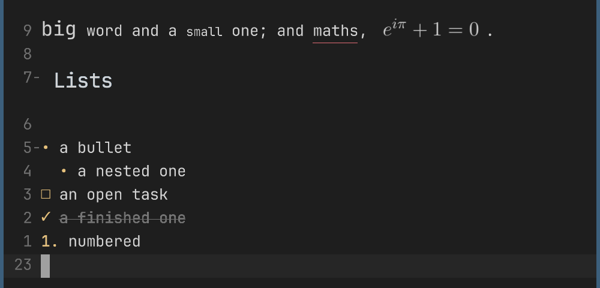
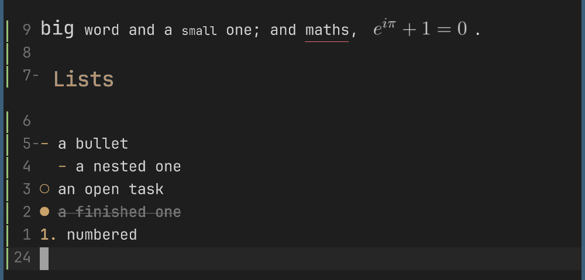
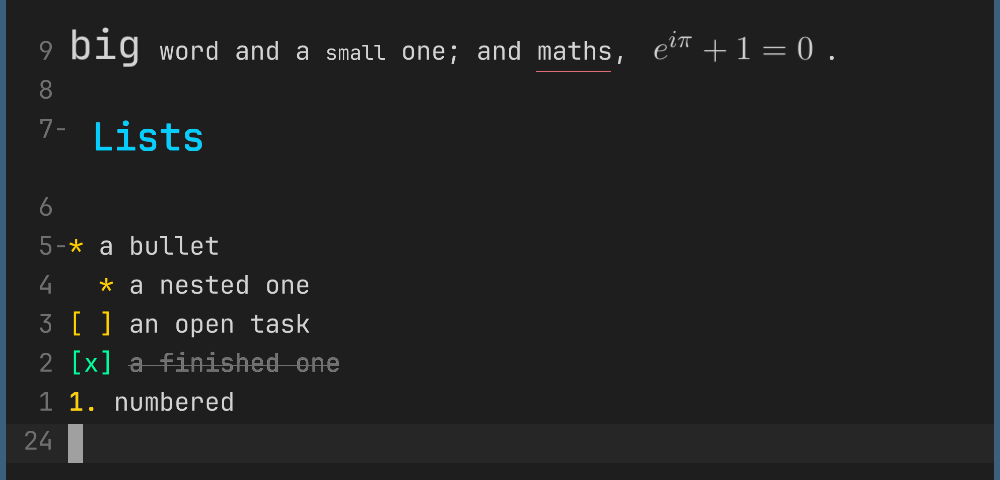
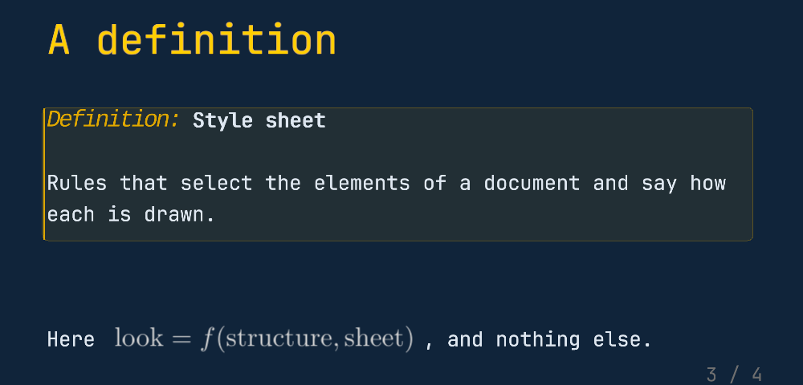

# mepml style sheets

A mepml document's look is a style sheet (`.mepss`), not the editor's code:
`docs/mepml-spec/style.md` specifies the language, and mep's own default
look is one (`assets/mepml/default.mepss`).

- `styles.mepml` — a document that exercises most elements. Its header names
  the sheet: `//? Style: paper.mepss`.
- `paper.mepss` — a quiet look with colours of its own.
- `contrast.mepss` — a loud one, with an `@media present` section.
- `deck.mepml` + `deck.mepss` — a small presentation and a sheet for
  presenting it (`<leader>kp`): the page's paper, the title page, the
  slides' cards in the editor, and colours for its exports.

| | |
| --- | --- |
| mep's default look | `paper.mepss` |
|  |  |
| `contrast.mepss` | `deck.mepss`, presenting |
|  |  |

Open `styles.mepml` in mep, then edit and save one of the sheets beside it:
the document restyles as soon as the file is written. A sheet in
`~/.config/mep/mepml.mepss` applies to every document.

Exports take the sheets too (`mep-mepml convert styles.mepml out.html`, or
`.pdf`, `.docx` ...): both sheets carry `@media` sections with colours for
white paper.

`mep-mepml style styles.mepml` prints the style every element computes to;
`mep-mepml tree styles.mepml` prints the document's element tree as JSON.
