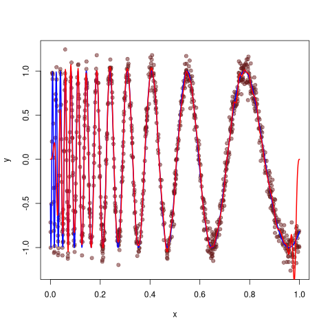

Here's some inline latex: $\alpha + \beta = \gamma$

Now, here's some latex in a block:
\[
\int_{-\infty}^{\infty} e^{-x^2} dx = \sqrt{\pi}
\]

#+begin_src R :results graphics :file ./test.png :exports both
data(iris)
head(iris)
plot(
  iris$Sepal.Length,
  iris$Sepal.Width,
  col = iris$Species,
  pch = 19,
  xlab = "Sepal Length",
  ylab = "Sepal Width"
)
#+end_src
#+RESULTS:
#+begin_example
  Sepal.Length Sepal.Width Petal.Length Petal.Width Species
1          5.1         3.5          1.4         0.2  setosa
2          4.9         3.0          1.4         0.2  setosa
3          4.7         3.2          1.3         0.2  setosa
4          4.6         3.1          1.5         0.2  setosa
5          5.0         3.6          1.4         0.2  setosa
6          5.4         3.9          1.7         0.4  setosa
NULL
#+end_example

